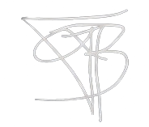

<div align="center">

# FAB.DEV — Portfólio

### Onde código encontra criatividade

[](https://react.dev)
[](https://www.typescriptlang.org)
[](https://tailwindcss.com)
[](https://vitejs.dev)



</div>

---

## Visão Geral

Portfolio pessoal com estética **comic book / mangá**, seguindo arquitetura **Clean React** (Manguinho). Cada seção é um "quadrinho" interativo com texturas de papel, ink splatters, halftone dots e animações suaves.

## Features

- **Tema Dark/Light** — alternância com `next-themes`
- **Animações** — Framer Motion com scroll-triggered transitions
- **Design HQ** — paper texture, ink splatters, speed lines, halftone edges
- **Responsivo** — layout fluido `95vw → 85vw`, funciona em 4K
- **Tipografia** — Space Grotesk (display) + Inter (body)
- **Ícones SVG** — categorizados por linguagem, framework e ferramenta
- **GitHub API** — stats públicos (commits, streak, linguagens)
- **Clean Architecture** — componentização SRP, commits convencionais

## Tech Stack

| Categoria | Tecnologia |
|-----------|------------|
| Framework | [React 19](https://react.dev) |
| Linguagem | [TypeScript 6.0](https://www.typescriptlang.org) |
| Build Tool | [Vite 8.2](https://vitejs.dev) |
| Estilo | [Tailwind CSS 4.1](https://tailwindcss.com) |
| UI | [shadcn/ui](https://ui.shadcn.com) + [Lucide Icons](https://lucide.dev) |
| Animação | [Framer Motion 13](https://www.framer.com/motion) |
| Tema | [next-themes](https://github.com/pacocoursey/next-themes) |
| Fonts | [Space Grotesk](https://fonts.google.com/specimen/Space+Grotesk) + [Inter](https://fonts.google.com/specimen/Inter) |
| Package Manager | [pnpm](https://pnpm.io) |
| Testes | [Jest](https://jestjs.io) + [Testing Library](https://testing-library.com) |
| Storybook | [Storybook 8.6](https://storybook.js.org) |

## Estrutura

```
src/
├── lib/                          # Utilitários (cn)
├── presentation/
│   ├── assets/                   # Ícones SVG organizados
│   │   ├── languages/
│   │   ├── frameworks/
│   │   ├── db-&-tools/
│   │   ├── icons/                # Logos do símbolo pessoal
│   │   └── projects/
│   ├── components/
│   │   ├── layout/               # Navbar
│   │   ├── providers/            # ThemeProvider
│   │   └── ui/                   # Typography, Tabs, Decorations, SectionAnimation
│   ├── data/                     # Dados centralizados
│   ├── main/                     # Entry point + Layout
│   ├── pages/
│   │   ├── home/                 # Hero + Ilustração
│   │   ├── about/                # Bio + GitHub Profile
│   │   ├── skills/               # Tabs + Grid de skills
│   │   ├── projects/             # Cards com imagens
│   │   ├── experiences/          # Timeline profissional
│   │   └── contact/              # Links + Footer
│   └── styles/                   # Global CSS + Paper Texture
└── index.html
```

## Arquitetura

Seguindo os princípios do **Clean Architecture** adaptado para frontend:

- **SRP** — cada componente faz uma coisa só
- **YAGNI** — nada criado antes da necessidade
- **Componentização** — extração lógica em sub-componentes
- **Commits convencionais** — `feat`, `refactor`, `chore`, `fix`
- **Gitflow** — branches `main`, `develop`, `feature/*`

## Getting Started

```bash
# Instalar dependências
pnpm install

# Iniciar desenvolvimento
pnpm dev

# Build para produção
pnpm build

# Visualizar build
pnpm preview
```

## Scripts Disponíveis

| Script | Descrição |
|--------|-----------|
| `pnpm dev` | Servidor de desenvolvimento com HMR |
| `pnpm build` | Build de produção (tsc + vite) |
| `pnpm preview` | Preview do build local |
| `pnpm lint` | Verificação de código |
| `pnpm lint:fix` | Auto-correção de código |
| `pnpm test` | Executar testes |
| `pnpm test:watch` | Testes em modo watch |
| `pnpm storybook` | Iniciar Storybook |
| `pnpm build-storybook` | Build do Storybook |

## Paleta de Cores

| Cor | Hex | Uso |
|-----|-----|-----|
| Violet | `#7C3AED` | Primary, destaques |
| Purple | `#8B5CF6` | Acentos, links |
| Paper | `#D8D5CC` | Background light |
| Blue | `#3B82F6` | Tema light logo |
| Dark | `#0A0C12` | Background dark |

## Deploy

O projeto pode ser deployado em qualquer plataforma estática:

- [Vercel](https://vercel.com)
- [Netlify](https://netlify.com)
- [GitHub Pages](https://pages.github.com)

```bash
# Build
pnpm build

# A pasta dist/ está pronta para deploy
```

## License

Projeto pessoal. Todos os direitos reservados.

---

<div align="center">

**Feito com intenção** — 2026

[](https://github.com/fabriciomdc)
[](https://www.linkedin.com/in/fabriciomdc/)
[](mailto:fabriciomdec@gmail.com)

</div>
